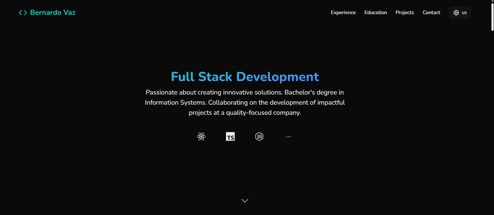

# Portfolio

Portfolio built with Next.js, with GitHub repository display.

<p align="center">
  
</p>

### Features

- Responsive layout with Tailwind CSS (mobile-first)
- Smooth animations using Framer Motion
- Modern UI with dark theme and subtle transparency
- Smooth scrolling for better navigation
- GitHub: fetches and displays repos
- Interalization for English and Portuguese with next-intl

## Stack

- Next.js and Turbopack
- Tailwind CSS
- Framer Motion
- TypeScript
- next-intl for internationalization
- Icons, Lucide React and React Icons
- Nunito

## Getting Started

1. Install dependencies:

```bash
npm install
```

2. Start development server:

```bash
npm run dev
```

3. Open [http://localhost:3000](http://localhost:3000)

## Scripts

- `npm run dev` - Start development server with Turbopack
- `npm run build` - Build
- `npm run start` - Run production server
- `npm run lint` - ESLint

## Environment

- Node.js 18
- Next.js 15
- React 19

## License

MIT
